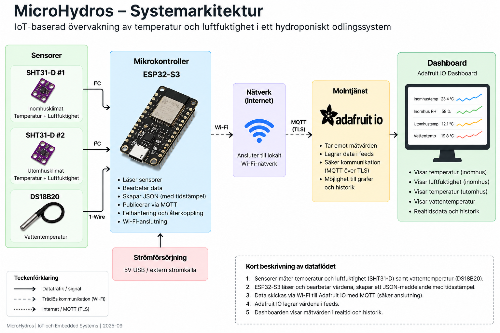

# MicroHydros - Prototyp 1

## Projektets syfte

Denna prototyp samlar in miljödata från en hydroponisk odlingsmiljö och skickar mätdata via MQTT till en extern tjänst (Adafruit IO) för övervakning och lagring över tid. Projektet är utvecklat på uppdrag av HydroGreen Fingers AB.

Systemet mäter:
- Temperatur inne
- Temperatur ute
- Luftfuktighet inne
- Temperatur i vattnet

## Arkitekturdiagram

## Nödvändiga beroenden

### Hårdvara

- ESP32-S3
- 2 × SHT31-D
- DS18B20
- 4.7 kΩ motstånd

### Mjukvara

- C/C++
- PlatformIO
- ESP32-plattform
- MQTT

### Molntjänst

- Adafruit IO-konto
- MQTT
- Feeds för mätdata

## Hur systemet byggs eller startas

1. Klona repositoryt:
   `git clone https://github.com/WhiteWolf313/MicroHydros.git`

2. Öppna projektet i VS Code.

3. Kontrollera att PlatformIO är installerat och att projektets beroenden är tillgängliga.

4. Anslut ESP32-S3 till datorn.

5. Bygg och ladda upp projektet med PlatformIO.

6. Starta om ESP32-S3 och kontrollera att systemet startar och ansluter till Wi-Fi.

## Grundläggande användning

När systemet är igång läser ESP32-S3 av sensorerna och samlar in temperatur och luftfuktighet. Mätdata behandlas och skickas via Wi-Fi och MQTT till Adafruit IO.

Mätningarna sker återkommande och datan kan därefter visas och följas över tid via Adafruit IO Dashboard.

## Projektstruktur

- `src/` – projektets C/C++-kod
- `include/` – konfigurationsfiler och headerfiler
- `lib/` – bibliotek
- `docs/` – projektets dokumentation, tester och arkitekturdiagram
- `platformio.ini` – PlatformIO-konfiguration